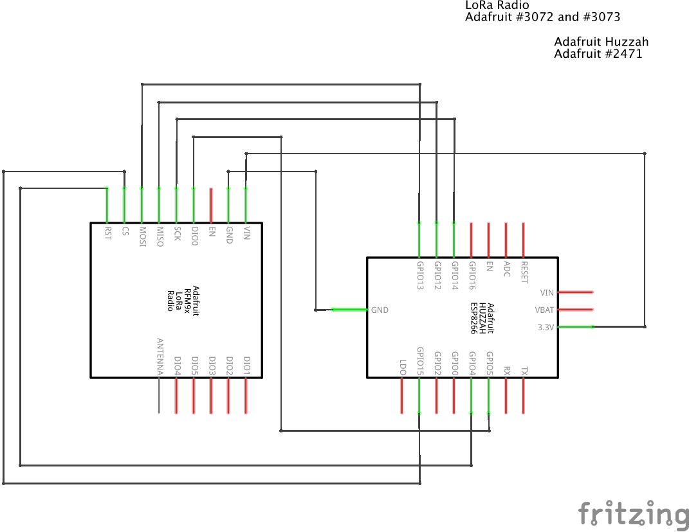

# Steamlink Workshop

This workshop is to help you get started with Steamlink. The first version of this workshop was run at the Toronto Public Library, Fort York branch in May 2018 as part of a series on P2P networks.

## A Brief Introduction To Steamlink

[Steamlink](https://github.com/steamlink/steamlink-arduino) is a low-power netwoking platform. The Steamlink vision is to give makers the ability to rapidly and easily deploy fully self-hosted, robust, and secure networks of low-powered devices. Currently, Steamlink is in active development.

## Setup

Before the workshop, the facilitator will need to set up:

1. An instance of the Steamlink store on a unix machine
2. Atleast one WiFi to LoRa bridge on the same network as the Steamlink store
3. Provide kits for participants to set up nodes

### Setting up the Steamlink Store

The store repository can be found [here](https://github.com/steamlink/steamlink) but we recommend installing from pypi. SteamLink is best installed in a Python virtual environment. It requires python version 3.6 or better, and the python pip module.

*NB*: For the May 2018 workshop, [v0.9.2](https://github.com/steamlink/steamlink/tree/v0.9.2) was used

#### 1. Create en environment (for example 'sl') for SteamLink	
```
$ python3 -m venv sl
```

#### 2. Activate the new environment 
```
$ . sl/bin/activate
```

#### 3. Install (or upgrade) SteamLink from pypi 
```
$ pip3 install --upgrade steamlink
```
Alternatively, if you have cloned the githup repository, you can install SteamLink with 
```
$ python3 setup.py install
```
#### 4. Generate a configuration file

Steamlink will run with configuration defaults, if you don't specify a config file. We recommend creating a default config file with the command:
```
$ steamlink --createconfig
```
It will create steamlink.yaml in your home directory. You can use the -c <filename> option to specify different name and/or location, both for creating and for running steamlink. Use the -h flag 
for help on available command options.

#### 5. Start the Steamlink store instance

After editing the config you can start steamlink with
```
$ steamlink
```

#### 6. Connect to the Web Console

Open up a browser on a machine that's on the same local network as the store and navigate to `steamlink.local`

If there's a problem with mDNS, the default host is `localhost:5050`

### Setting up the bridge and node kits

#### 1. Install the Steamlink Arduino Library for your Arduino IDE
Steamlink Arduino can be found at [this repository](https://github.com/steamlink/steamlink-arduino). It can be installed like any other Arduino library (Adafruit has a useful [guide](https://learn.adafruit.com/adafruit-all-about-arduino-libraries-install-use/arduino-libraries)). 


*NB*: For the May 2018 workshop, [v0.3.0](https://github.com/steamlink/steamlink-arduino/tree/v0.3.0) was used

#### 2. Acquire the bridge hardware

You can either purchase an ESP + LoRa combo boards (search for "Heltec LoRa" on AliExpress) or build one yourself. Here's a schematic if you want a DIY board:



#### 3. Acquire the hardware for the nodes

[Adafruit feather M0 with RFM95](https://www.adafruit.com/product/3178) is an excellent beginner friendly board that plays well with the Arduino environment. You could also use the cheaper Chinese boards, including the Heltec ones (which can serve the dual purpose of running as bridges).

#### 4. Flash your bridge code
1. Locate the sample bridge code under the `SteamLink Library/Examples/SL_bridge0` directory, and make a copy in your workspace. It should include two files: `SL_bridge0.ino` and `SL_Credentials.h-sample`

2. Remove the `-sample` from the extention of the SL_Credentials file and update your WiFi and MQTT credentials from the store here. Make sure your store MQTT server can accept connections with these credentials.

3. Use the Arduino IDE to flash your bridge hardware

4. Power up the board and see if it works

#### 5. Flash your nodes

There is code for 7 workshop nodes in this repository, named after locations in Toronto.
1. [Bathurst](bathurst/bathurst.ino)
2. [Bloor](bloor/bloor.ino)
3. [Dupont](dupont/dupont.ino)
4. [Fort York](fortyork/fortyork.ino)
5. [Jane](jane/jane.ino)
6. [Queen](queen/queen.ino)
7. [Union](union/union.ino)

You can make additional ones by copying and renaming the node directory (eg. bathurst) and updating the `SL_ID` and `config` struct.

Use the Arduino IDE to flash each node individually

## Running the workshop

#### 1. Power up the store and the bridge
See above for instructions.

#### 2. Hand out the kits to participants

Each kit should include:
1. A breadboard
2. A flashed LoRa board such as the [Adafruit feather M0 with RFM95](https://www.adafruit.com/product/3178)
3. An LED
4. A 10K ohm resistor
5. A push button
6. Atleast 5 M-M jumper cables
7. A power cable for the LoRa board

#### 3. Participants should wire up their boards

1. Feather Pin 5 connects to the LED +’ve side (longer leg)
2. Feather Pin 6 connects to the micro-switch
3. -’ve side of the LED connects to a resistor to ground
4. Make sure all the grounds are connected
5. Power up using power cable


#### 4. Interact with nodes using web console
1. Pressing the button should send a message to the console
2. Try sending ‘1’ or ‘0’ to your node from the web console to turn on and off the LED
3. Observe the RSSI (ie. the Received Signal Strength Indicator): move the node and see how the RSSI is affected

#### [OPTIONAL] 5. Visualize with an SDR
Use an SDR to visualize LoRa packets. You should be able to see something like this:


*Image credit* [bertrik](https://revspace.nl/Bertrik)


